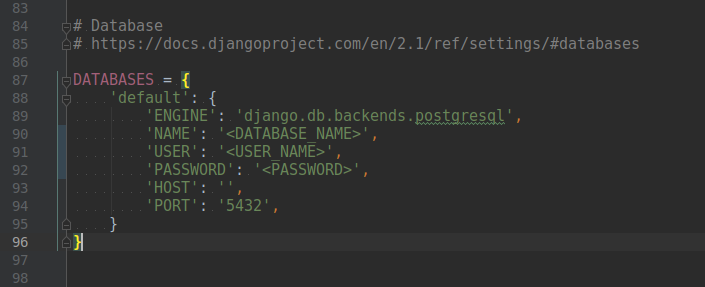
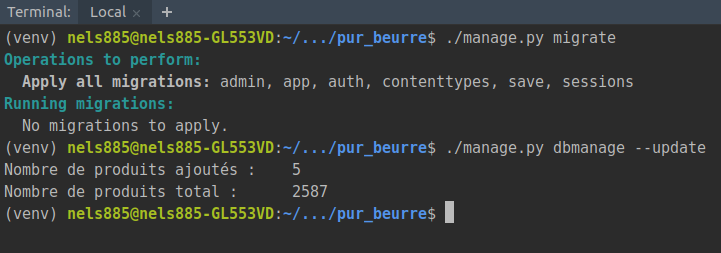

# Pur Beurre

Pur Beurre is a Python application made with the Django framework. This allows the user to search for a substitute food based on nutrition grade.

Food information that is embedded in the database has been retrieved through the OpenFoodFacts API.

## Start guide

### Dependencies

* [Python 3.6 or more](https://www.python.org) is required
* [PostGreSQL](https://www.postgresql.org/download/)

### Installation instructions

* install Python 3.6 or more
* install PostgreSQL

Create a database and a proprietary user account for this database.

Ubuntu example:

    $ sudo -i -u postgres
    $ createuser -P --interactive <user_name>
    Enter password for new role:
    Enter if again:
    Shall the new role be a superuser? (y/n) n
    Shall the new role be allowed to create databases? (y/n) y
    Shall the new role be allowed to create more new roles? (y/n) y
    $ createdb -O <user_name> -E UTF8 <database_name>

Collect the pur_beurre repo and install the dependencis as below:

    $ git clone https://github.com/Nels885/pur_beurre.git
    $ cd pur_beurre
    $ pip3 install -r requirements.txt

### Configuration

Then you have to modify the **"settings.py"** file which is in the **"pur_beurre"** folder with the parameters of your database.

Part to edit in settings.py:

We will then initialize the database and add in it data thanks to the API of OpenFoodFacts with the commands below.

    $ ./manage.py migrate
    $ ./manage.py dbmanage --update

example of result after execution of commands:

You must also create a super user with the command below.

    $ ./manage.py createsuperuser
    
Just follow the instructions in the console.

## Starting the server

    $ ./manage.py runserver

You can now access your application from your browser at **"localhost: 8000"**

---

this project is part of the formation of "Python application developer" of OpenClassrooms.

    

    
